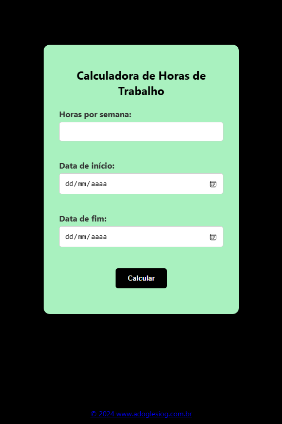

# 📋 Calculadora de Horas de Trabalho

Projeto: Uma calculadora simples para estimar o total de horas trabalhadas em um período, baseada em horas semanais e datas de início/fim.

# Preview do Projeto 

# 🛠️ Tecnologias Utilizadas
HTML5 (Estrutura semântica)

CSS3 (Estilos responsivos)

JavaScript (Lógica de cálculo)

# ⚙️ Funcionalidades 

Calcula horas totais com base em: 
   Horas trabalhadas por semana.
   Data de início e fim do período.

Validações:
   Campos obrigatórios.
   Data final não pode ser anterior à inicial.

Saída:
   Exibe o resultado formatado.

# 🚀 Como Executar
Clone o repositório:

# bash
git clone https://github.com/adoglesio/CalculadoraHorasTrabalho.git
Abra o arquivo index.html no navegador.

# 📸 Captura de Tela

Screenshot da Calculadora

# 📝 Licença
Este projeto está sob a licença MIT. Veja o arquivo LICENSE para detalhes.

